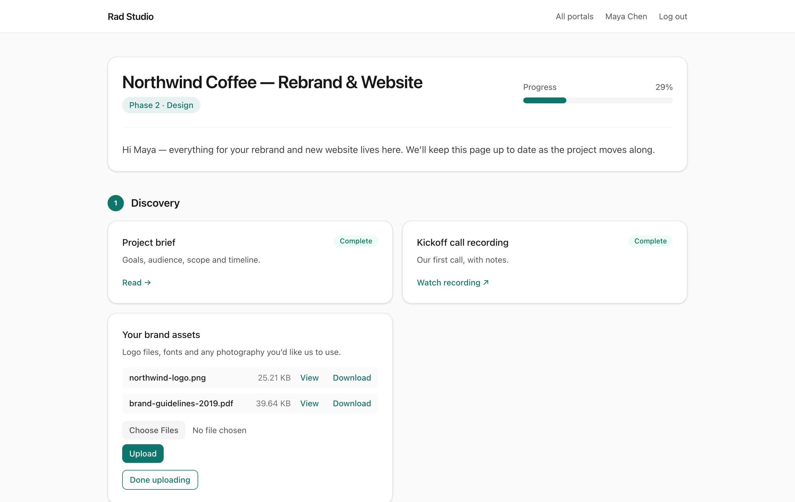
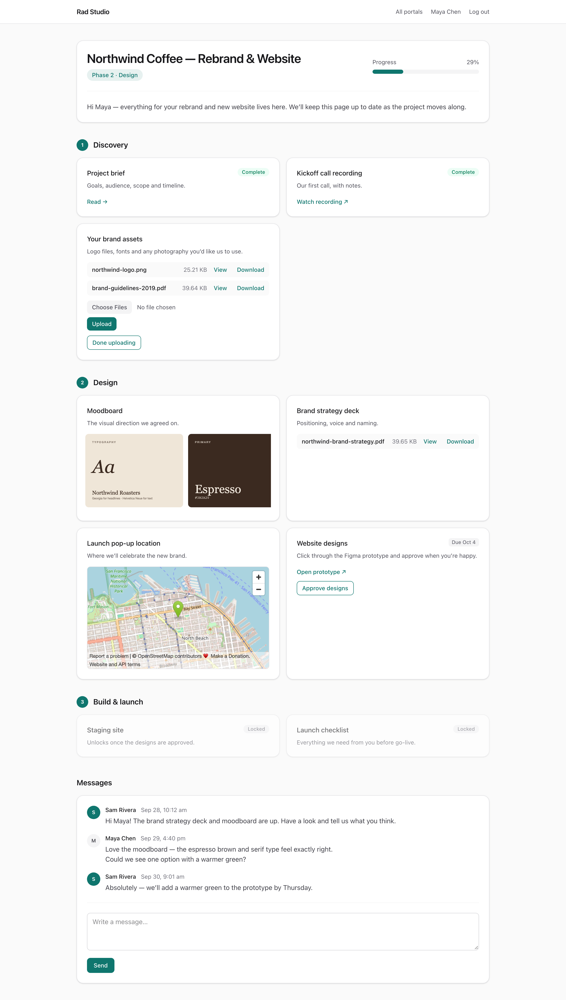
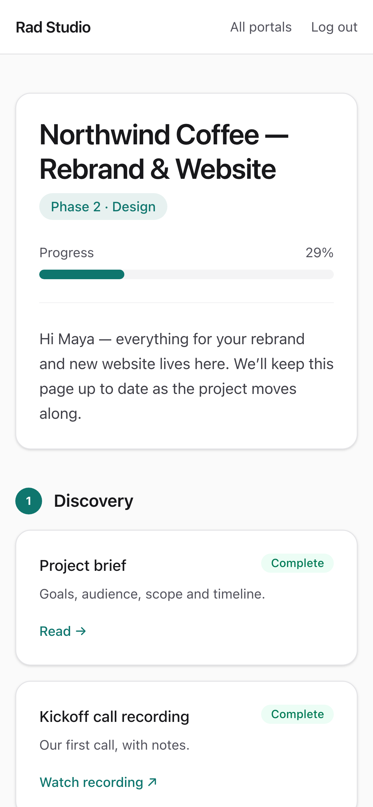
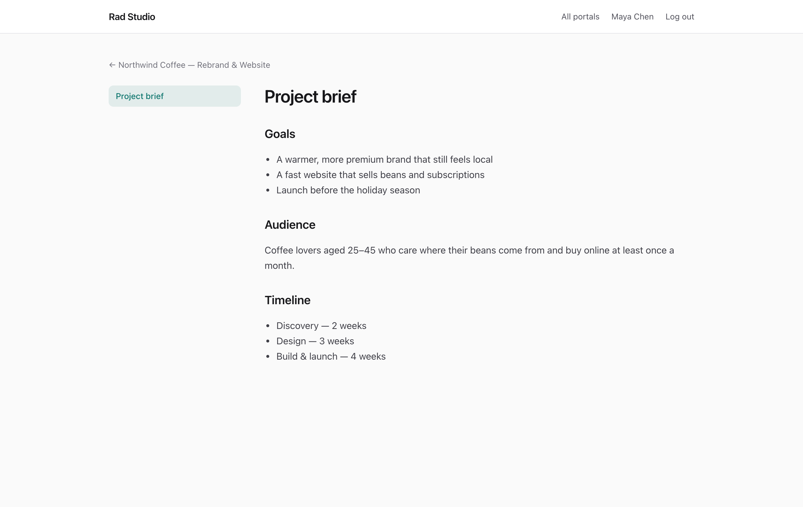
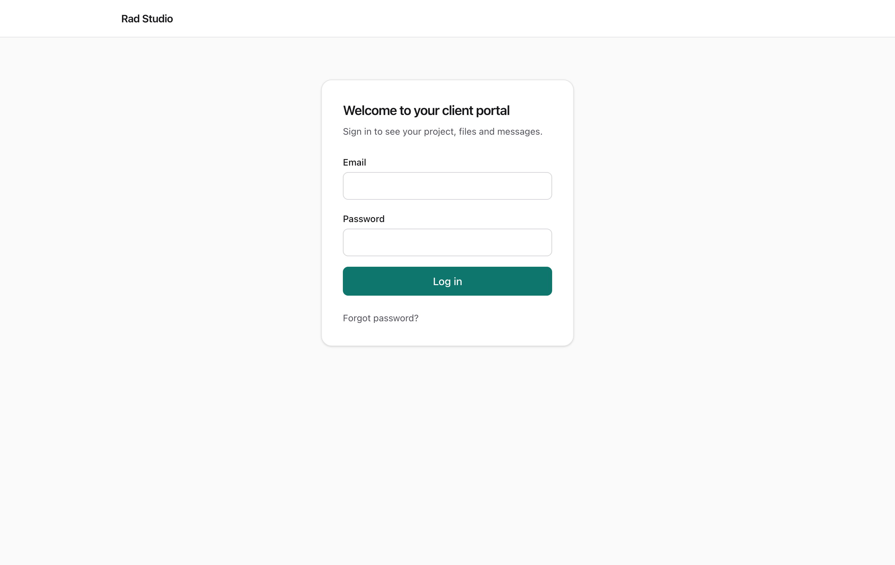
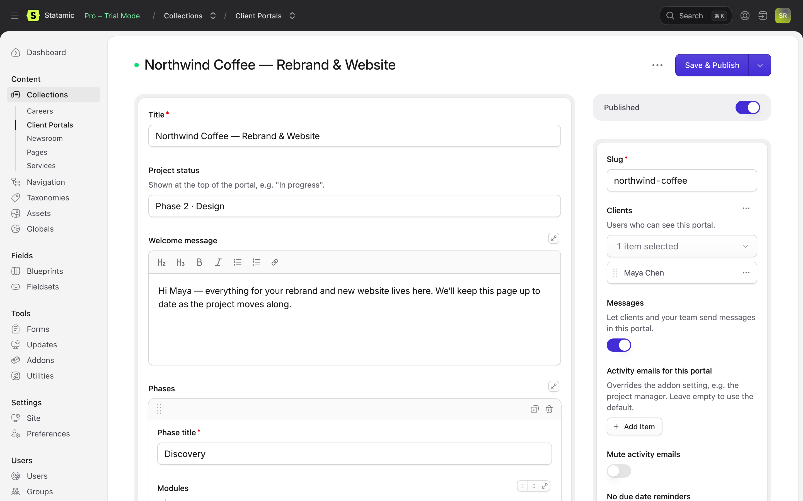
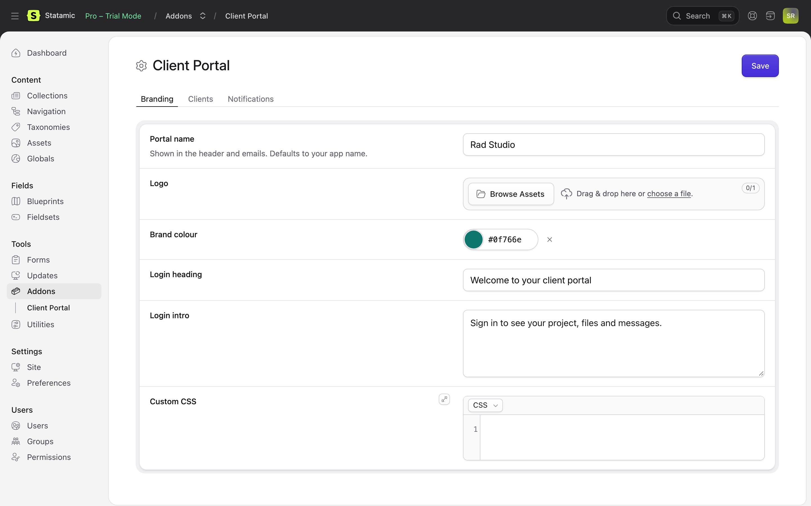

# Client Portal for Statamic



Give every client a private, branded portal: project status and progress, phases, files, uploads, galleries, embeds, content pages, approvals, messages, reminders and activity emails.

## Screenshots

| | |
|---|---|
|  |  |
|  |  |
|  |  |

## Requirements

- Statamic 6, PHP 8.3+
- A mail driver, for notifications
- The Laravel scheduler (`php artisan schedule:run` every minute), for reminders and digests

## Installation

```bash
composer require rad-themes/client-portal
php please client-portal:install
```

The install command creates:

- the **Client Portals** collection and its blueprint (`resources/blueprints/collections/portals/portal.yaml`, yours to customise)
- the private **Portal Files** asset container, stored in `storage/app/client-portal`
- a **client** role
- an example **Website project** template portal (skip it with `--no-example`)
- the portal stylesheet, in `public/vendor/client-portal`

Clients use the portal at **`/portal`**.

## Setting up a portal

1. Create a user for your client, or let clients register themselves (see below).
2. In **Collections → Client Portals**, create an entry, or duplicate a template. Pick the client in **Clients** and add phases and modules.
3. Optionally run the **Notify clients** action on the entry to email its clients.

Clients only see portals they're assigned to. Super users, and roles with the **View Client Portals entries** permission, see all of them.

### Modules

| Module | What the client sees |
|---|---|
| Link | A button to any URL |
| File download | Files from the private container, served only through the portal after an access check. PDFs, images, video, audio and text files get a **View** link that opens them in the browser. |
| Client upload | An upload form. Files are stored privately under `uploads/` in the **Portal Files** container and listed on the module in the portal. |
| Content page | A page of rich content, with sidebar navigation between pages |
| Image gallery | A swipeable row of images from your `assets` container |
| Embed | An embedded Figma, Loom, YouTube, Google Docs, Google Calendar or Typeform URL, etc. |

Every module has:

- **Status:** *Active*, *Inactive* (shown as locked and can't be opened) or *Complete*. The portal's progress bar is the share of non-inactive modules that are complete.
- **Due date:** shown on the card; clients get a reminder email before it.
- **Client can mark complete:** adds a button (e.g. "Approve designs") that marks the module complete and notifies you.

If an editor has a portal open while a client completes a module, saving the editor won't undo the client's completion. An editor who opens the portal afterwards can still set the module back to Active.

### Messages

Turn on **Messages** in a portal's sidebar to add a message thread to it. When a client writes, you get an activity email; when your team writes, the portal's clients get an email.

### Per-portal notifications

A portal's sidebar can:

- send its activity emails to different people (e.g. the project manager)
- mute its activity emails
- turn off its due date reminders

### Templates

Turn on **Template** in an entry's sidebar to make it a template. Templates are never shown to clients.

- **New portal from a template:** use Statamic's **Duplicate** action, then turn off *Template* and assign clients.
- **Update many portals at once:** select portals and run **Apply template**. Their phases and modules are replaced with the template's. Progress on modules that exist in both (same ID) is kept: status, completion and uploads.

## Settings

**Tools → Addons → Client Portal → Settings**

- **Branding:** portal name, logo, brand colour, login heading and intro, custom CSS
- **Clients:**
  - *Let clients register themselves* adds a sign-up page at `/portal/register`. New sign-ups get the client role, and their own copy of a template if you choose one.
  - A registration captcha: reCAPTCHA v2 or Cloudflare Turnstile, using your site and secret keys.
  - Maximum upload size.
- **Notifications:**
  - Email about client activity (completions, uploads): off, instantly, or as a daily digest.
  - Who receives activity emails. Defaults to all super users.
  - How many days before a due date reminders go out (0 turns them off).

## Scheduled commands

Registered automatically, provided the Laravel scheduler is running:

| Command | When |
|---|---|
| `client-portal:send-reminders` | Daily, 08:00 |
| `client-portal:send-digest` | Daily, 17:00 |

## Import and export

```bash
php please client-portal:export acme-website portal.json
php please client-portal:import portal.json --slug=acme-website-copy
```

Exports leave out clients and client uploads. Imported portals are created unpublished.

## Translations

Every string goes through Laravel's translator. To translate the portal, copy the addon's `lang/en.json` to your site's `lang/{locale}.json` (e.g. `lang/de.json`) and translate the values.

## Multisite and content drivers

Portals live in your default site. Localizations share the origin's clients and modules, so each portal appears once. The addon only uses standard queries, so it works with flat files or the Eloquent driver. Uploads and completion logs are stored on the `client_portal` disk. On multi-server setups, point that disk at shared storage such as S3 by defining `client_portal` in `config/filesystems.php`.

## Customising

- **Colour:** use the Brand colour setting, or set `--portal-brand` in custom CSS.
- **Views:** copy any view from the addon's `resources/views` into `resources/views/vendor/client-portal` and edit it there.
- **Reserved URLs:** `/portal/login`, `/portal/register`, `/portal/forgot-password` and `/portal/reset-password`. Don't give a portal one of those slugs.

## Security notes

- Every portal page, download, upload and completion checks that the user is assigned to the portal.
- Portal files live outside the web root and are only served through the access check.
- Client uploads are limited by type (documents, images, audio/video, design files and archives, but no HTML, SVG or scripts) and by size.
- Portals send `noindex`, and downloads send `Cache-Control: private, no-store`. Portal routes never go through Statamic's static cache.
- Message text is escaped. Uploads are renamed and stored under unguessable folder names.

## License

Client Portal is free, open-source software released under the [MIT license](LICENSE.md).

## Development

```bash
composer install
vendor/bin/phpunit
npm run build   # rebuilds resources/dist/portal.css
```
